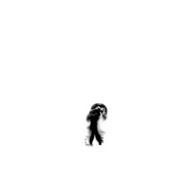
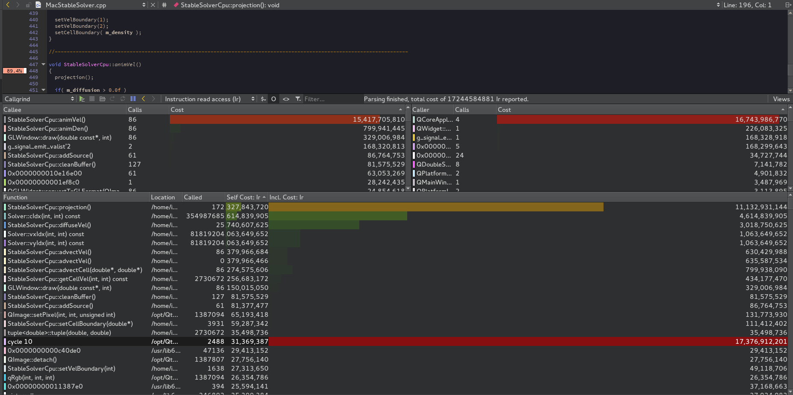
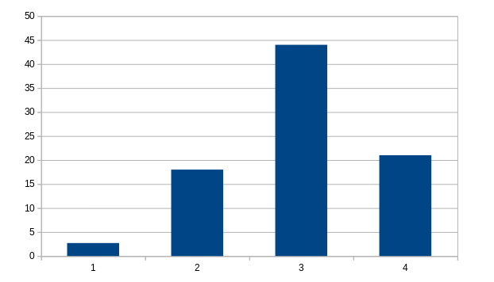
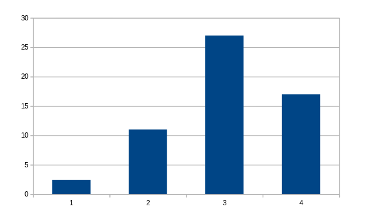
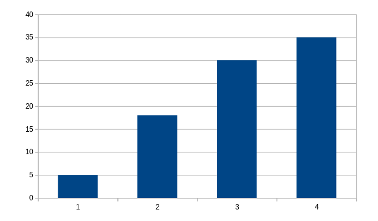
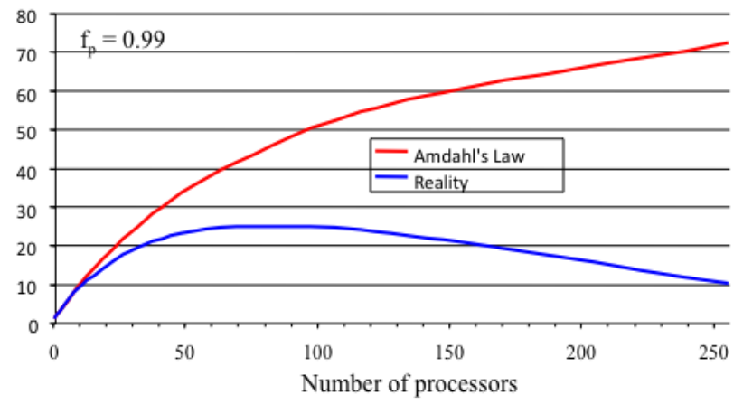

# Stable Fluids
<p align="center">
  
</p>


Parallel implementation of Jos Stam's Stable Fluids

## Project Overview
This Project was developed as a third year programming assignment,
The brief required to get a working algorithm and write it in parallel using CUDA.
I chose the [original solver](https://github.com/finallyjustice/stablefluids) 
because it was a really efficient and fast implementation that uses a Data Oriented approach.

### Configuration
The following environment variables are needed to compile this out of the box:
* CUDA_PATH : Needs to point to the base directory of your cuda lib and includes
* CUDA_ARCH : Your local device compute (e.g. 30 or 52 or whatever)
* HOST_COMPILER : Your local g++ compiler (compatible with cuda compiles, g++ 4.9)

In order to compile and run the application:
* Qmake
* make
* run $$PWD/bin/application

### Dependencies
* [Qt]( https://www.qt.io/ ) - QtCreator was my IDE of choice, I also used [QWidget](http://doc.qt.io/qt-5/qwidget.html) and [QImage](http://doc.qt.io/qt-5/qimage.html)
* [CUDA](https://developer.nvidia.com/cuda-toolkit) - used to accelerate the Solver in parallel
* [OpenGL](https://www.opengl.org/) ( 4.0 ) - used to draw the smoke simulation
* [Google Test](https://github.com/google/googletest) - used to test the correctness of the implementation
* [Google Benchmark](https://github.com/google/benchmark) - used to measure the speed-ups

### Project Structure
The project is divided in:

* solver_cpu: the serial implementation of the solver, slightly changed from the original version,
the subProject compiles into a shared library

* solver_gpu: the parallel version of the solver, 
the subProject compiles into a shared library 

* application: The OpenGL project that uses the two libraries and runs the simulation

* Test: This project's sole purpose is to check that every component works correctly

* Benchmark: This small project is used to measure the speed-ups

##### Common
Common contains libraries and headers that the solvers and the applications need:
* [glm](https://glm.g-truc.net/0.9.8/index.html) - used in the application
* [parameters](https://github.com/albelax/StableFluids/blob/master/Common/include/parameters.h) - used to tweak the parameters of both solvers
* [Solver](https://github.com/albelax/StableFluids/blob/master/Common/include/Solver.h) - base class for both solvers, perhaps not the best decision but made it easy to swap between the two from the application side
* [tuple](https://github.com/albelax/StableFluids/blob/master/Common/include/tuple.h) - a simple generic container, also defines the type "real", used to swap easyly between floats and doubles

## Workflow
### Analysis - Profiling
The first task of the project was to detect the most expensive components of the solver, I did that using [Callgrind](http://valgrind.org/docs/manual/cl-manual.html) embedded in QtCreator



As showed in the image above the most expensive part of the solver was the velocity step ( animVel ), the second most expensive call is the projection, which calculates the pressure,
and it's run two times in the velocity step, so I knew that the pressure was going to be the most important function to speed up on the GPU.

### Implementation
Due to the nature of the project I knew I had to define my own work flow to minimize errors and make sure I was proceeding in the right direction.
My approach similar to [test driven development](https://en.wikipedia.org/wiki/Test-driven_development), 
I would write the test before implementing new components, once implemented, tested against the original solver, and made sure the test passed I would benchmark that component.

### Coding Standard
The coding standard I followed is the **NCCA** coding Standard:
* [Code Layout](https://nccastaff.bournemouth.ac.uk/jmacey/NCCACodingStandard/CodeLayout.html)
* [Style and Practices](https://nccastaff.bournemouth.ac.uk/jmacey/NCCACodingStandard/StyleAndPractice.html)
* [Class Layout](https://nccastaff.bournemouth.ac.uk/jmacey/NCCACodingStandard/ClassLayout.html)

However I took some freedom in naming the kernels, which I defined using **d_** before the name of the kernel
```
__global__ void d_projection( real * _pressure, real * _divergence );
```

## The GPU Solver

### Structure
The solver inherits from Solver.h, in the common folder, the class is defined in the [GpuSolver.h](https://github.com/albelax/StableFluids/blob/master/solver_gpu/include/GpuSolver.h) and the class is implemented in [GpuSolver.cu](https://github.com/albelax/StableFluids/blob/master/solver_gpu/cudasrc/GpuSolver.cu), which looks like a normal c++ class, however all the functionalities are implemented in [GPUSolverKernels.cu] (https://github.com/albelax/StableFluids/blob/master/solver_gpu/cudasrc/GpuSolverKernels.cu), this meant that I could write cuda kernels and wrap them up in methods of a class, allowing me to take advantage of CUDA's performance while keeping a high level interface.

### Micro Optimisations
Moving the solver from serial to Parallel provided a significant speed-up, however I decided to adapt a few techniques to reduce overheads whenever possible:
* Constant memory, something similar to an L2 cache, slower than L1 cache but way faster than global memory, I decided to store data that was commonly used in global memory so I could avoid launching a kernel with the same data every time.

* Streams, usually kernels are launched asynchronously, but once launched they get queued up and they execute one at the time,
whenever possible I used multiple streams to launch and execute kernels in parallel, of course this was rarely possible as most of the components are interdependent.

### Communication between threads
Communication between threads was achieved by using shared memory and most of the times I got away with using a simple gather between neighbor cells; I tried to avoid mutexes and atomic adds as much as possible as they could slow down the algorithm ( I had to use mutexes anyway to calculate the boundary conditions, which unavoidable ).

### Future Improvements
The parallel implementation of the solver definetly faster than the serial version, however is not perfect.
In order to make it even better it would be necessary to increase GPU occupancy, which is now roughly at 40%, this could be achieved launching kernels with bigger blocks, launching more kernels in parallel using more streams, something that I did whenever was possible but I did not try to do even further. The Algotithm could be improved as well, however, for this assignment I decided not to improve the algorithm to present a fair comparison between the serial and the parallel implementations.


## Results
Benchmarked on:
* GPU: NVIDIA GTX 1080
* CPU: Intel® Core™ i7-7700K CPU @ 4.20GHz × 8 

### 64x64

|      Benchmark       |      Time      |     CPU       | Iterations |
| ---------------------|----------------|---------------|------------|
| CPU_solverCreation   |        17 ns   |        17 ns  |   40403571 |
| GPU_solverCreation   |        19 ns   |        19 ns  |   36194377 |
| CPU_solverActivation |     80724 ns   |     80697 ns  |       8521 |
| GPU_solverActivation |    649797 ns   |    644707 ns  |       1157 |
| CPU_projection       |   1365934 ns   |   1365945 ns  |        513 |
| GPU_projection       |    547331 ns   |    547332 ns  |       1000 |
| CPU_advectVelocity   |    360546 ns   |    360548 ns  |       1767 |
| GPU_advectVelocity   |     68330 ns   |     68331 ns  |      10000 |
| CPU_advectCell       |    240370 ns   |    240371 ns  |       2818 |
| GPU_advectCell       |     31872 ns   |     31873 ns  |      22616 |
| CPU_diffuseVelocity  |   2665851 ns   |   2665869 ns  |        263 |
| GPU_diffuseVelocity  |    595574 ns   |    595581 ns  |       1000 |
| CPU_diffuseDensity   |   1171699 ns   |   1171712 ns  |        597 |
| GPU_diffuseDensity   |    770841 ns   |    770832 ns  |      10000 |
| CPU_animateVelocity  |   3079318 ns   |   3078935 ns  |        229 |
| GPU_animateVelocity  |   1119373 ns   |   1119329 ns  |        685 |
| CPU_animateDensity   |    240566 ns   |    240569 ns  |       2912 |
| GPU_animateDensity   |     31930 ns   |     31929 ns  |      22686 |
| CPU_addSource        |     28556 ns   |     28555 ns  |      24572 |
| GPU_addSource        |    147887 ns   |    147715 ns  |       4914 |

### 128x128

|      Benchmark         |       Time       |      CPU      |  Iterations  |
|------------------------|----------------- |---------------|--------------|
|  Creation_of_a_string  |          4 ns    |         4 ns  |   196118568  |
|  CPU_solverCreation    |         17 ns    |        17 ns  |    40455472  |
|  GPU_solverCreation    |         19 ns    |        19 ns  |    36708187  |
|  CPU_solverActivation  |     298321 ns    |    298324 ns  |        2349  |
|  GPU_solverActivation  |     667458 ns    |    663841 ns  |        1123  |
|  CPU_projection        |    6713939 ns    |   6700848 ns  |         105  |
|  GPU_projection        |     605262 ns    |    603770 ns  |        1319  |
|  CPU_advectVelocity    |    1451872 ns    |   1446323 ns  |         484  |
|  GPU_advectVelocity    |      80009 ns    |     79694 ns  |       12957  |
|  CPU_advectCell        |    1020521 ns    |   1016595 ns  |         695  |
|  GPU_advectCell        |      39250 ns    |     39095 ns  |       18304  |
|  CPU_diffuseVelocity   |   10697569 ns    |  10656041 ns  |          65  |
|  GPU_diffuseVelocity   |     884542 ns    |    880996 ns  |        1000  |
|  CPU_diffuseDensity    |    5091461 ns    |   5071702 ns  |         140  |
|  GPU_diffuseDensity    |     620473 ns    |    618055 ns  |        1545  |
|  CPU_animateVelocity   |   23396999 ns    |  23305178 ns  |          34  |
|  GPU_animateVelocity   |    1287062 ns    |   1282012 ns  |         601  |
|  CPU_animateDensity    |    1022019 ns    |   1018040 ns  |         695  |
|  GPU_animateDensity    |      39247 ns    |     39088 ns  |       18368  |
|  CPU_addSource         |     108270 ns    |    107843 ns  |        6476  |
|  GPU_addSource         |     205904 ns    |    205107 ns  |        3409  |


### 256x256

| Benchmark             |         Time   |          CPU  | Iterations  |
|-----------------------|----------------|---------------|-------------|
| CPU_solverCreation    |        17 ns   |        17 ns  |   40430214  |
| GPU_solverCreation    |        19 ns   |        19 ns  |   37751948  |
| CPU_solverActivation  |   1307306 ns   |   1307305 ns  |        539  |
| GPU_solverActivation  |   1132863 ns   |   1125006 ns  |        648  |
| CPU_projection        |  32270398 ns   |  32263586 ns  |         22  |
| GPU_projection        |   1184480 ns   |   1184185 ns  |        641  |
| CPU_advectVelocity    |   6153712 ns   |   6153789 ns  |        114  |
| GPU_advectVelocity    |    198935 ns   |    198928 ns  |       4975  |
| CPU_advectCell        |   4283895 ns   |   4283607 ns  |        163  |
| GPU_advectCell        |     95228 ns   |     95226 ns  |      10000  |
| CPU_diffuseVelocity   |  48446876 ns   |  48439043 ns  |         14  |
| GPU_diffuseVelocity   |   2195355 ns   |   2195217 ns  |       1000  |
| CPU_diffuseDensity    |  25586086 ns   |  25586407 ns  |         27  |
| GPU_diffuseDensity    |    783454 ns   |    783346 ns  |       1000  |
| CPU_animateVelocity   | 122734220 ns   | 122680635 ns  |          8  |
| GPU_animateVelocity   |   2739802 ns   |   2738564 ns  |        292  |
| CPU_animateDensity    |   4281516 ns   |   4280389 ns  |        163  |
| GPU_animateDensity    |     92921 ns   |     92915 ns  |      10000  |
| CPU_addSource         |    415360 ns   |    415351 ns  |       1682  |
| GPU_addSource         |    435225 ns   |    435059 ns  |       1620  |


### 512x512

|Benchmark             |         Time  |          CPU  | Iterations |
|----------------------|---------------|---------------|------------|
|CPU_solverCreation    |        17 ns  |        17 ns  |   40436539 |
|GPU_solverCreation    |        19 ns  |        19 ns  |   36814170 |
|CPU_solverActivation  |   2773967 ns  |   2774004 ns  |        252 |
|GPU_solverActivation  |   2257457 ns  |   2241661 ns  |        316 |
|CPU_projection        |  73668478 ns  |  73669022 ns  |          9 |
|GPU_projection        |   4235135 ns  |   4235172 ns  |        173 |
|CPU_advectVelocity    |  22364119 ns  |  22364411 ns  |         31 |
|GPU_advectVelocity    |    623548 ns  |    623555 ns  |       1000 |
|CPU_advectCell        |   9752254 ns  |   9751313 ns  |         71 |
|GPU_advectCell        |    358102 ns  |    358105 ns  |       3381 |
|CPU_diffuseVelocity   | 117031137 ns  | 117032585 ns  |          6 |
|GPU_diffuseVelocity   |  11642810 ns  |  11642845 ns  |       1000 |
|CPU_diffuseDensity    |  58518501 ns  |  58519198 ns  |         12 |
|GPU_diffuseDensity    |   3629575 ns  |   3629614 ns  |       1000 |
|CPU_animateVelocity   | 203896799 ns  | 203899402 ns  |          4 |
|GPU_animateVelocity   |   9435029 ns  |   9434779 ns  |        100 |
|CPU_animateDensity    |   9752684 ns  |   9752804 ns  |         71 |
|GPU_animateDensity    |    358652 ns  |    358656 ns  |       3394 |
|CPU_addSource         |    927384 ns  |    927391 ns  |        753 |
|GPU_addSource         |    808545 ns  |    808486 ns  |        863 |

### velocity Step speedup

<p align="left">
1 = 64x64, 2 = 128x128, 3 = 256x256, 4 = 512x512
</p>

### Projection speedup


### Velocity Advection speed-up


### Conclusion
The speedup is small, sometimes the CPU seems to outperform the GPU, whenever the dataset is small, since the communication overhead between cpu and gpu is higher than the speedups( Benchmark 64x64, column 1 in the graphs above ), it then spikes up ( Benchmark 256x256, column 3 in the graphs above), and then after the optimal size of the dataset the acceleration seems to to reach a plateau or even decrease ( Benchmark 512x512, or last column of the graphs above ) which follows the trend of the blue line of the graph below.

<p align="center">
  
</p>
